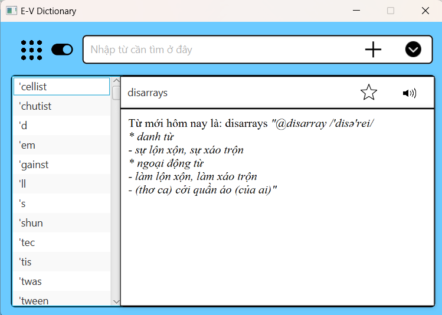

# Introduction
This is a small project about my OOP course. This application provides basic functions such as word lookup, text translation, and Vietnamese - English dictionary support.

# Demo
-  
-  [video Demo](https://drive.google.com/drive/folders/1aTXWFjdPPjFUU9qv9Yzr8-2RLz5FdHpc?usp=sharing)
-  [video on youtube](https://www.youtube.com/watch?v=2gNYJOdHiYE)
# Getting Started
**Note**: Make sure you have completed [JAVA basic Tutorial](https://www.w3schools.com/java/) and [Object Oriented Programming](https://www.w3schools.com/java/java_oop.asp) or you are in the process of learning Java

## Step1: Install and setup Javafx module
Firs, you will need **Javafx** module and Scence Builder to support about build interface of project.

You can install _Javafx_ it at [Gluon](https://gluonhq.com/products/javafx/) and follow the [instruction](https://openjfx.io/openjfx-docs/) to running the firs programming.If you have set up these in your decvices, please skip this step.

## Step2: Run the program
 
- Clone this project.
- Import the voice RSS lib to library of project.
- Import file database mysql(edict.sql) to your database and change the name of database, password accordingly.
- Open project in IDE.
- Find the file name Main.java in package screen to run program.
- If you want change data, you can change file database and V_E.txt file.

# About this project
**Uses**:

- Two-way lookup: Supports lookup from Vietnamese to English and vice versa.
- Translate long text with many characters.
- Show search history.
- Speech word (English-Vietnamese).
- Quizz game to memorize vocabulary. 

**Usage**:

- Select mode: Click to toggle button to change English-Vietnamese to Vietnamese-Vietnamese dictionary.
- Translate the text

  - Click to the Menu button, and choose Translate.
  - Type the word you want to search for in the search field and press Enter or click on the suggested word to see the meaning of the word.
  - Click to "X" button to return Main screen of dictionary.

- Add, edit or delete word from dictionary.
  - Click to the cross shaped button to add Word, edit word or delete word in dictionary.
  - To add new word, click to the add word
  - To edit any word in dictionary, click to edit word
  - To delete any word in dictionary, click to delete word.

- Game quizz
  - Click to menu button and choose Game.

**Resource**:
- Javafx and Scence Builder for Front End Development.
- The Free Vietnamese Dictionary database for Dictionary.
- Google Translate API to translate any character, text or word.
- Voice RSS API to speech any word, text.
- Text to Speech library (Free TSS) to speech any word.
- Lingoes to sql database conversion tool.
- V_E file data for V-E dictionary.

# UML class

# Developer
- Nguyen [ducminh-uet](https://github.com/ducminh-uet) Viet Duc:

  - Back end dev
  - Tester
  - UX dev
  - TTS API and Google translate API
  - Collect data and Connect to database
  - Develop version cmd
- Nguyen [HungEB2098](https://github.com/hoanglmv/Dictionary/commits?author=HungEB2098) Huu Viet Hung :

  - Design UI
  - Front end dev
  - Back end dev
  - UX dev
  - Develop version cmd
- Le [hoanglmv](https://github.com/hoanglmv/Dictionary/commits?author=hoanglmv) Mai Viet Hoang:
  - Develop version cmd
  - Desgin and develop Game application
  
# Contributing 
- Pull requests are welcome. For major changes, please open an issue first to discuss what you would like to change.
# Troubleshooting
- **Error : JavaFX runtime components are missing, and are required to run this application** 
  
   - You need add VM Options for Main class to run program. Please follow the instruction at [Getting Started with Javafx.](https://openjfx.io/openjfx-docs/)

- **Or you can  see the [Troubleshooting](https://docs.oracle.com/javafx/2/deployment/troubleshooting.htm) page.**

# Project status
The project is completed.